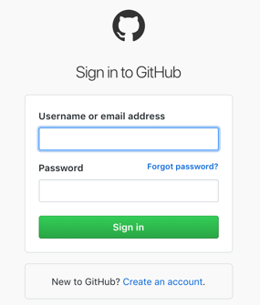
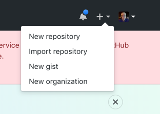
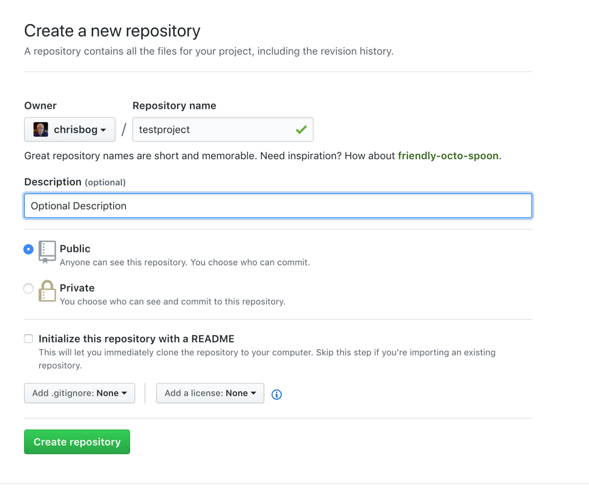
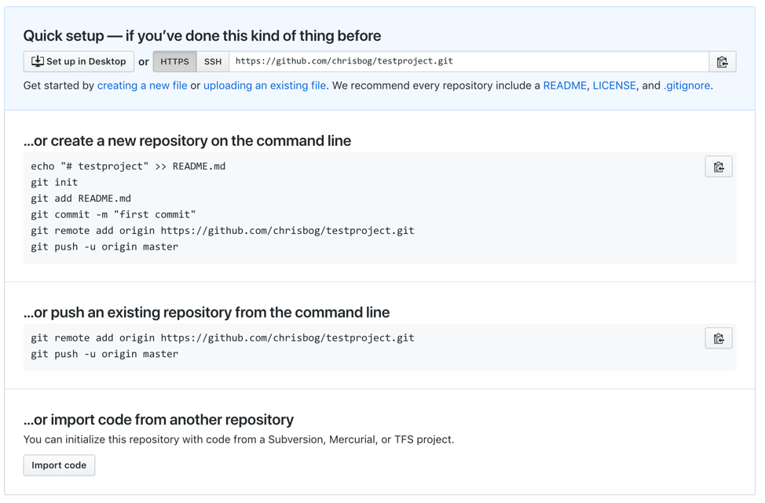
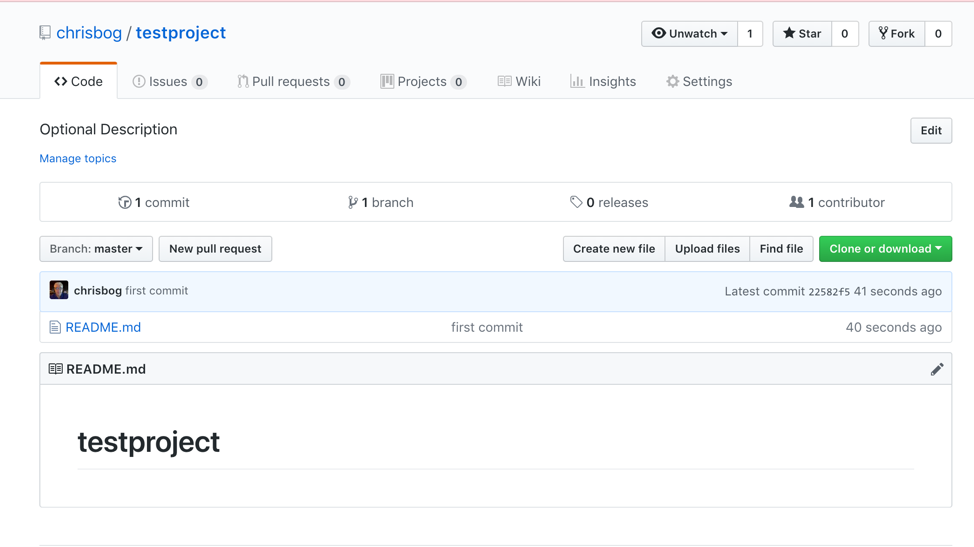

#Lesson 1
##Creating my first git repository

The first step is to go to github.   If you don't already have an account, you will need to create one.   However the URL for this is:

[http://www.github.com](http://www.github.com)

Note, once you create a username, all github repositories will be in the following format:

`https://github.com/{username}/{repo-name}`

For example, my username is: chrisbog and the repository that we are using for this demo is: testproject.

Therefore, the direct url for this would be:

`http://github.com/chrisbog/testproject`

###Logging into github
Go to the [http://www.github.com](http://www.github.com).   You will see the following screen:


Once you log into with your username and password, you should see all the repositories that you have created.   In the upper right hand corner there is a '+' sign.   If you click on that symbol, it will take you to the following screen:



Once you select "New repository", you will be taken to the following screen to provide details about the repository.   The only mandatory field is "Repository name".  This is where you create the repository.

Within this field you can enter some other items:

* **Description** - Description is always useful
* **Public/Private**- By default all repos in github are public.   If you wanted a private repository, you will need a subscription.
* **Initialize this repository with a README** - By default all repos should have a README.md file.   Therefore, you can either create one here or we can create one later.   For this example we are going to create one later.
* **Add .gitignore:** - This is a more advanced topic, but will allow git to ignore certain files in the directory.
* **Add a license** - This is very important for any source control.   You need to add a license so that other people know how they can leverage your code.   Please see this blog as a good tutorial:  [https://blog.github.com/2013-07-15-choosing-an-open-source-license/]()

Now let's call this new repository **testproject**.   Then click on the "Create repository button:


We have now successfully created out first project.   However, since there is nothing in the repo, the next screen comes.   From here there are multiple paths we can take. 


Normally what I always do is create the new repository from scratch on your computer.   Go to a command prompt.

First create a directory where we want the new project:

```mkdir testproject
cd testproject
```

Let's create a sample file and name it README.md.   For now it doesn't matter what is in this file.

Once the file is create, we can actually leverage the commands that git provides. Don't worry, we will step through them so you understand what is going on:

```echo "# testproject" >> README.md
git init
git add README.md
git commit -m "first commit"
git remote add origin https://github.com/chrisbog/testproject.git
git push -u origin master
```

Let's step through these one by one:

* `git init` - This command initializes a new git repository on our computer.   This should always be the first command
*  `git add README.md` - This command is adding the file README.md to the staging area.   You can use any type of wildcards for this command as well.   However, I would be very concerned about using wildcards to ensure that we don't accidentally add a file that we might not want into source control.
*  `git commit -m "first commit"` - This commands creates a comment as to the first commit.   Therefore, all the files that we added to the staging area will basically be tagged with a description.   This will make it helpful when we look at the history of a file to understand what was changed.
*  `git remote add origin https://github.com/chrisbog/testproject.git` - This command is very important.  This command actually makes a connection between our local computer directory and the remote repository that we created.   Once this command is entered, we can start pushing code both ways.
*  ``git push -u origin master` - This command actually initiates the push of the changes from our local directory up to the repository.   We are specifying the "master" keyword.   This represents what branch of the repository we are going to push these changes.    Don't worry about this yet because we will cover it more later.

Now let's go back to our previous repo in github and refresh it.   You should now see the following:


Congratulations!   We just finished our first lesson on creating a repository and adding a file to it.   In the next lessons will will see more and more activities on how to do more with this archive.


* [Next lesson](../lesson2/lesson2.md)
* [Back to table of contents](../README.md)
