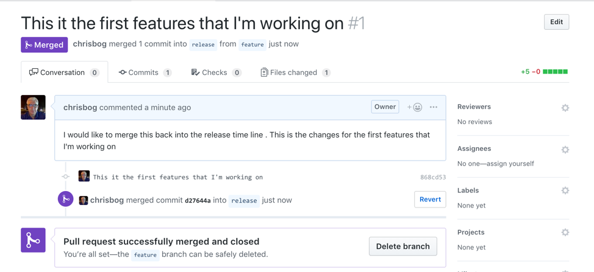

# Lesson 2
## Managing a branch workflow for people working in groups
Where the power of git and github comes in is the ability for use to manage a project while multiple people are working on it.   In this tutorial, we are going to simulate a single developer working on this project.

The workflow that i'm going to follow very closely mimics a piece of the following graphic.   In this graphic, we are going to have a master branch of our software development effort.    From this master branch, we are going to have multiple developers working on this product.


In future examples, we will see more detailed examples on how people can work on the same project.

## Release methodology
So when working on a project as a group, what is the best way to work together on the same project?   After reading alot of documents, on the issue, I really like the following workflow.   Not only does this follow github very closely, but it makes alot of sense from a development standpoint.

We are going to use three different types of releases for this code example:

* production - This is the production code that our customers will be leveraging.
* release - This is a new release of code that we will be creating.   This might represent different versions that we eventually would be publishing.   Think of this as the next version of code.
* feature - This is the version of our code that we are currently developing on.

The idea is that production is what our customers are using, release is the next version of code, and feature is the individual features within that new release of code.

With this high level methodology, you can create really complex software development projects and have git and github manage the repositories fully.

## Branching capabilities in git
So the principal component of this will be leveraging branches in both git and github.   You can think of branches as a independent snapshot of our code where were can make changes, play, and experiment and not affect other code.

By default, when you create a repository in github, it is created in a master branch.  In our example, we are going to leverage the difference branches to mimic our release methodology.

### master
1.	The Master Branch should always have a copy of the existing code in Production.
2.	No-one — including the tech lead — should be coding directly in the master branch since it is a copy of production code.
3.	The actual code is written in other branches.

### release
1.	When the project begins the first thing to do is to create a release branch for the project. The release branch is created from the master branch.
2.	All code pertaining to this project will be in the release branch. The release branch is just a normal branch with the prefix release.
3.	Let’s call the release branch for this example release.
4.	It’s possible that there are multiple projects running on the same code base. So, for each project, a separate release branch is created. Let’s say there is one more project running in parallel. Then that project can have a separate release branch like release-ver1
5.	The reason to have a release branch is that the same code base can have multiple projects running in parallel — there should be no conflict between the projects.

## Create a release branch
Go back to our testproject github repository.   If you look at the repository, there is a button on the middle left that says branch:master.    If you click on this button, it will show you all the different branches that are created or allow you to create new branches.

For this step, let's create a new branch called `release` by typing in the name and then hitting the button named: **Create branch: release**


Once the branch is created we can click on the **Branch:** button and select any available branch.   Since we only have one created, click on the **Branch: release** branch and ensure that it is showing.


github is now showing what code is displayed in the release branch.  This isn't very interesting since there is nothing different between the release branch and master branch.    However, we will make it interesting shortly.

### Alternative method to create branch
Even though we showed you how to create a branch using the web site, you can also create a new branch via the command line.   The following are examples:

Let's first show the current branches that are located within our repository.   When we run this command, the * represents the current selected branch.   We see there is only one branch called master and the ```*``` next to the branch states that we are currently in the master branch.

```
$ git branch
* master

```
If we run the following command we will see that we are currently up to date.

```
$ git status
On branch master
Your branch is up-to-date with 'origin/master'.
nothing to commit, working tree clean
```
Let's create the new branch called **release**

```
$ git branch release
```

## Synchronize our changes with github

Let's synchronize with github

```
git pull
From https://github.com/chrisbog/testproject
 * [new branch]      release    -> origin/release
Already up-to-date.
```
Now let’s switch to the release branch

```
git checkout release
```

Finally, let's make sure we are really in the **release** branch.

```
git branch
  master
* release
```

There you have it all we are now in the release branch which is separate from the master branch.   Now we are ready to start development.

## Create a feature branch

As we mentioned before, all of our code should be created on the feature branches.  With this methodology, we can follow the following rules:

1.	For every feature that is built in the application a separate feature branch is created. This ensures that the features can be built independently.
2. Feature branch is just like any other branch but with the prefix **feature**

We now need someone to work on a new feature of our software.  To show this workflow, let's do the following:

Let’s first start by switching to the release branch on our computer:

```
$ git checkout release
Branch release set up to track remote branch release from origin.
Switched to a new branch 'release'
```
Now let's create a new feature branch.

```
$ git checkout -b feature release
Switched to a new branch 'feature'
```
We used a different command line on this command.   What the checkout command is doing is:

* **-b** – create the new branch
* **feature** – name of the new branch
* **release** – the branch we want to base our new branch on

When we run the following command, we can see that there are three branches created.   And our feature branch is the currently selected one.

```
$ git branch
* feature
  master
  release
```
Now let's create a file called feature1.md.    This file would represent our code that we are currently working on.   You can use any editor to create this file.  You can quickly create a file under OSX or linux by doing the following:

```# This is a test file > feature1.md```

Once the file is created, let’s stage the newly created file and add a comment for this commit.

```
$ git add feature1.md 
$ git commit -m "This it the first feature that I'm working on"
[feature 868cd53] This it the first feature that I'm working on
 1 file changed, 5 insertions(+)
 create mode 100644 feature1.md
```
We can also use the `git log` command to see what is being staged

```
$git log
commit 868cd539ac9870b70fb329784eb07c3fdde45a4f (HEAD -> feature)
Author: Chris Bogdon <cbogdon@cisco.com>
Date:   Wed Nov 21 07:53:06 2018 -0500

    This it the first features that I'm working on

commit 22582f57d40663f5524188a8cbd18f28f4ab682d (origin/release, origin/master, origin/feature, release, master)
Author: Chris Bogdon <cbogdon@cisco.com>
Date:   Wed Nov 21 07:15:26 2018 -0500

    first commit

```
Since our code is now created, we want to push the code up to our repository.  Note the very first command.   We are pushing to the feature branch and that is why we are specifying the –set-upstream parameter.

```
$ git push --set-upstream origin feature
Counting objects: 3, done.
Delta compression using up to 8 threads.
Compressing objects: 100% (3/3), done.
Writing objects: 100% (3/3), 375 bytes | 375.00 KiB/s, done.
Total 3 (delta 0), reused 0 (delta 0)
To https://github.com/chrisbog/testproject.git
   22582f5..868cd53  feature -> feature
Branch feature set up to track remote branch feature from origin.
```
Now if we go back into the master repository on the github website, we see the following screen.   We are currently in the release branch, but we are getting a notification that there is a new pushed branch.   You can see that someone pushed something in the feature branch.  There is also a **Compare & pull request button**.   


Let's switch to the **feature** branch by clicking on the **Branch: release** button and select the **feature** branch.   Once the branch is displayed we can now see our file that we created previously.   In addition, we see the comment that we added to the commit for the feature1.md file.


## Create a pull request to have the changes accepted
Within the github website, there is a very important process called a pull request.   The pull request is a notification and function to alert the owner of the repository that you are finished with your feature and you want the lead developer to import the changes back into their branch.

Let's click on the **Compare & pull request** button on the previous screen.  In very simple terms the developer that coded the first feature wants to tell the tech lead that they are completed with their changes.   They would like to put the changes back into the main release branch.


Now the developer can write detailed information about the feature  that they just did finished.   This will provide much needed documentation for the tech lead or the repository owner to understand whether or not the change should be merged.     Let's add some notes to the editor.

In addition, this screen is providing a notification back to the developer that there is the ability to merge this change back into a different branch.   There are two drop down list boxes that allow you to select how to compare this branch with another branch.   In the example we are showing, we would like to use **base: release** as the base branch and we want to compare it to the feature branch: **compare: feature**.   This powerful feature allows us to compare any known branch wth others and see if they can merge easily.

When you scroll down a little further, you can see that differences between the current feature branch and the release branch.   In this example, we are showing that we added a file.


Once the developer is finished with their documentation, they click on the “Create pull request”.   This will signal to the tech lead that the pull request is completed and now the tech lead needs to approve the change.

## Approving the pull request
The tech lead or owner of the repository will now get a notification that there is a pull request that they need to act on.    As you can see, it shows that the user **chrisbog* wnats to merge 1 commit into release from feature.   This screen also shows the comments that the user made when they created the pull request.

Very similarly to before, it also tells the tech lead that the branch that we are attempting to merge has no conflicts with the base branch.


For now, let's click on the **Merge pull request** button.   Github will prompt the user 1 more time ensure that they want to merge the two changes.


Finally, we see that the feature was successfully merged.   We also see the option that we can delete the feature branch since we technically don’t need it anymore.



Now, let's got back to the original testproject in the release branch, the feature1.md is uploaded successfully in the release branch.


There is one other thing to note from this screen.   There is now a message that there is a new recently pushed branch called release.    This is because the changes that we incorporated into the release branch are not yet propagated to the master branch.   If you recall our methodology, the master branch represents the code that is in production.   The release represents the next version.    There is probably alot more effort need to make our release version production (ie., Documentation, Marketing, Testing, etc.).

If you click on the **Branch: release** button and select the **master** branch, you will see that it is the original version and we haven't incorporated the release changes yet.


## Conclusion
Well, congratulations!!!   In this lesson we learned the basics of creating a feature branch and using the workflows built in to github to create the pull request and merge the changes into the master branch.

* [Back to table of contents](../README.md)


